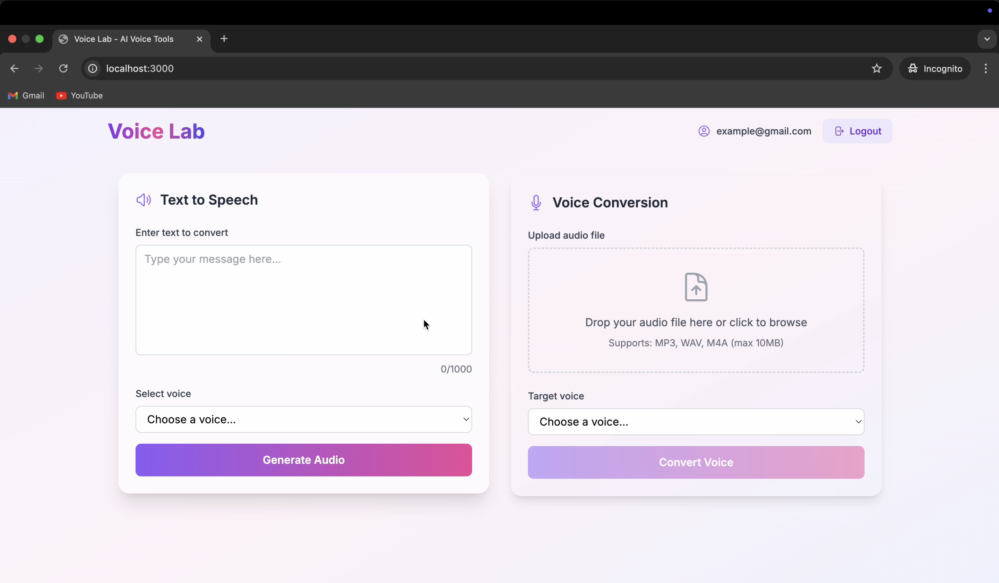

# 🗣️ VoiceLab 

**Transform text into natural speech and convert voices seamlessly—with full precision and unmatched flexibility.**

VoiceLab is a full-stack template that lets you reproduce the core workflow of commercial voice platforms—**entirely on your own infrastructure**. It couples two open-source neural speech models with a hardened cloud pipeline so you can (a) fine-tune new voices quickly and (b) serve high-throughput inference behind a single FastAPI gateway.

**Main building blocks:**
- **StyleTTS2** – high-fidelity text-to-speech
- **Seed-VC** – zero-shot + custom voice-to-voice conversion

Both StyleTTS2 and Seed-VC were fine-tuned on a personally collected 90-minute voice dataset, resulting in a fully custom voice that sounds nearly identical to the source speaker.

-----

## 📺 Demo


👉 Click on the image to see demo of Application
[](https://youtu.be/kNtJwR2FdPY?si=z1pIu_HMxelqsXgL)

---

## 🔍 Overall Module Breakdown

| Layer | Technology | Role in the System |
|-------|------------|--------------------|
| Data Prep | ffmpeg - Whisper L-v3 - Audacity - Python scripts | Create clean `(audio, transcript)` pairs |
| Model Training | PyTorch + Lightning - Docker - EC2 G5 Spot | Reproducible fine-tuning jobs |
| Frontend | Next.js 15 - React 18 - Tailwind - Auth.js | Auth, credit ledger, playback UI |
| Storage | AWS S3 (presigned GET/PUT) | Stateless blob store for wavs + models |
| Container Registry | AWS ECR | model training |

-----

## 🗂️ Dataset & Fine-Tuning Pipeline

| Step | Tool | Output |
|------|------|--------|
| Extract 90 min audio | `ffmpeg` | 48 kHz mono WAV |
| Auto-segment | VAD + silence script | 1–10 s clips |
| Transcribe | Whisper large-v3 | JSON + manual fixes |
| Clean audio | Audacity | Noise-free clips |
| Train | Docker + PyTorch Lightning on EC2 G5 | `*.pth` checkpoints to S3 |


-----

## ⚙️ How It Works

1. **Dataset Creation** → 90 minutes of Jasmine's tutorial videos processed into clean training data
2. **Feature Extraction** → Audio segmentation, transcription, and quality filtering  
3. **Model Fine-tuning** → StyleTTS2 and Seed-VC trained on custom dataset
4. **Local API Serving** → FastAPI endpoints running on laptop GPU
5. **Frontend Integration** → Next.js dashboard for voice generation and management

All compute, storage, and authentication reside in your AWS account—**no third-party AI services**.

-----

## ✨ Features & Tech Behind Each

| Feature | Tools / Services Used |
|---|---|
| 🎤 Dataset Collection | Custom video extraction + segmentation pipeline |
| 🔊 Text-to-Speech | `StyleTTS2` (PyTorch + FastAPI) |
| 🎭 Voice Conversion | `Seed-VC` (Self-hosted AI model) |
| 📊 Audio Processing | `ffmpeg`, `Whisper large-v3`, `Audacity` |
| 🤖 Model Fine-tuning | Docker + PyTorch Lightning on EC2 G5 Spot |
| 🐳 Model Containerization | Docker + FastAPI endpoints |
| ✅ Authentication | Auth.js (NextAuth) with JWT sessions |
| 📁 Audio Storage | AWS S3 with presigned URLs |
| 📱 Responsive UI | Next.js + Tailwind + T3 Stack |

-----

## 🛠 Project Stack

| Layer | Tech Stack |
|---|---|
| **Data Processing** | ffmpeg, Whisper L-v3, Audacity, Python VAD |
| **Model Training** | PyTorch Lightning, Docker, EC2 G5 Spot |
| **Backend APIs** | FastAPI, Uvicorn, NVIDIA CUDA |
| **Frontend** | Next.js 15, React 18, TypeScript, Tailwind CSS |
| **Authentication** | Auth.js (NextAuth) |
| **Storage** | AWS S3 (presigned URLs) |
| **Container Registry** | AWS ECR |
| **GPU Computing** | CUDA, PyTorch |

-----

## 📦 Local Dev Setup

### 1. Clone Project
```bash
git clone https://github.com/YOUR_USERNAME/voicelab.git
cd voicelab
```

### 2. Backend Setup (AI Models)
```bash
# StyleTTS2 API
cd StyleTTS2
pip install -r requirements.txt
uvicorn api:app --reload --port 8000

# Seed-VC API  
cd seed-vc
pip install -r requirements.txt
uvicorn api:app --reload --port 8001


```

### 3. Frontend Setup
```bash
cd frontend
npm install
npm run dev  # http://localhost:3000
```


✅ **Currently running locally for development.** All APIs serve from laptop GPU.

-----

## 🔐 Required Environment Variables

### Frontend
```env
NEXT_PUBLIC_AWS_REGION=us-east-1
NEXT_PUBLIC_S3_BUCKET=voicelab-storage
NEXTAUTH_URL=http://localhost:3000
AUTH_SECRET=your-super-secret-key

# Local API endpoints
NEXT_PUBLIC_TTS_API=http://localhost:8000
NEXT_PUBLIC_VC_API=http://localhost:8001
```

### Backend APIs
```env
AWS_ACCESS_KEY_ID=your-access-key
AWS_SECRET_ACCESS_KEY=your-secret-key
S3_BUCKET_NAME=voicelab-storage
API_KEY=your-api-key
```

-----

## ☁️ AWS Infrastructure

| Resource | Configuration |
|----------|---------------|
| **EC2 G5 (train)** | Spot, Docker, 500 GB GP3 scratch |
| **S3 voicelab** | `uploads/`, `outputs/`, `models/` prefixes |
| **ECR** | `styletts2-api`, `seedvc-api`, images |
| **IAM role voicelab-ec2** | S3 FullAccess, ECR ReadOnly |
| **IAM user voicelab-uploader** | Limited PUT/GET on `voicelab/uploads/*` |


### S3 CORS Configuration
```json
[
  {
    "AllowedHeaders": ["*"],
    "AllowedMethods": ["GET", "PUT", "POST"],
    "AllowedOrigins": ["*"],
    "ExposeHeaders": ["ETag"]
  }
]
```

### IAM Policy (voicelab-api user)
```json
{
  "Version": "2012-10-17",
  "Statement": [
    {
      "Effect": "Allow",
      "Action": [
        "s3:PutObject",
        "s3:GetObject",
        "s3:ListBucket"
      ],
      "Resource": [
        "arn:aws:s3:::your-bucket-name",
        "arn:aws:s3:::your-bucket-name/*"
      ]
    }
  ]
}
```


-----

## 🎯 Special Thanks & Credits

**Voice dataset: Jasmine** ([@Jasmineimis](https://github.com/Jasmineimis)) — Thanks for 90 minutes of top-tier tutorial audio that made this fine-tuned voice model possible! Your contribution demonstrates the importance of quality datasets in AI development.

*Voice cloning was done with full consent and for educational/demonstration purposes.*


-----

## 🚀 Future Deployment Plans

Currently running locally for development. Planned cloud architecture includes AWS ECR for containerized models and EC2 G5 instances for production inference.

-----

## 🧑‍💻 Author

**Varshan A V R** 

-----

## 📄 License

MIT — free to use, adapt, and deploy commercially.
